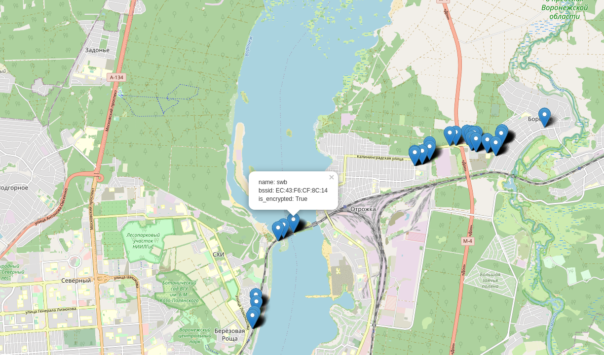

# wifi map project

Проект c целью создания карты точек wifi.

## Как это работает

- gps_collector: С помощью телефона с установленным на нем termux/termux api записываются текущие координаты в csv файл.
- wifi_collector: С помощью любого устройства с wifi и установленным на нем python3  (например raspberry pi) записывается информация о доступных точках wifi в csv файл.
- solver: Полученные данные с wifi_collector и gps_collector обьединяются и  на основе них строится список точек с их приблизительными координатами.
- viewer: Отображает информацию о найденных точках на карте. 